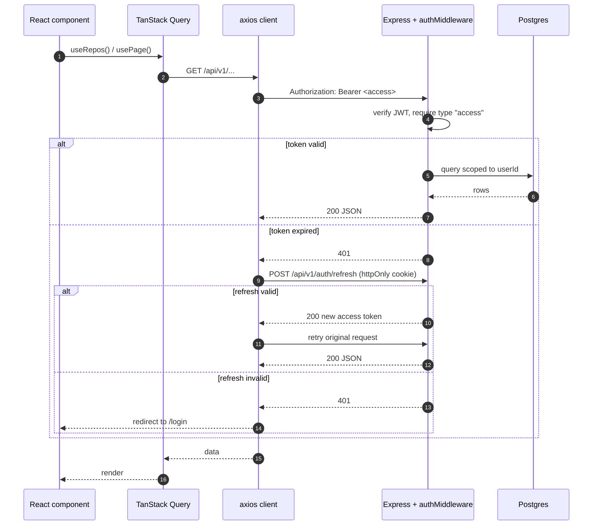
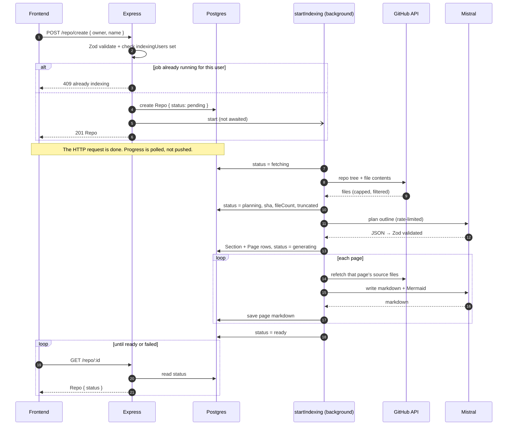
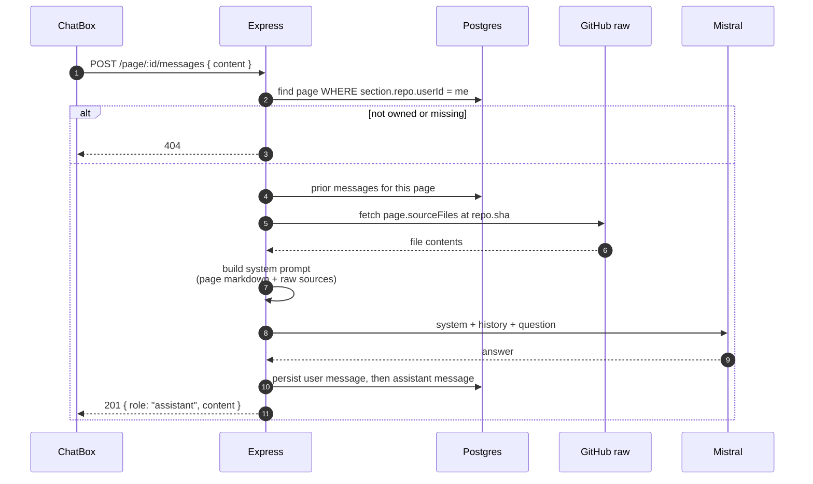

# GitFlow

Turn any public GitHub repository into browsable, AI-generated documentation — with a chat that answers questions about each page, grounded in that page's actual source files.

You give it `owner/name`. GitFlow fetches the repo tree, has an LLM plan a documentation outline (sections → pages), then writes each page as markdown with Mermaid diagrams. The result is a docs site for a codebase that never had one.

## How it works

```
POST /api/v1/repo/create
        │
        ▼
  Repo { status: pending }  ──►  201 returned immediately
        │
        │  (background job, one per user)
        ▼
  fetching   GitHub API → file tree + contents (skips lockfiles, binaries, node_modules)
        ▼
  planning   LLM → JSON outline, validated with Zod → Section / Page rows
        ▼
  generating LLM → markdown + Mermaid per page, using only that page's source files
        ▼
  ready      docs are browsable; per-page chat is live
```

Indexing is fire-and-forget: the API returns as soon as the `Repo` row exists, and the frontend polls `Repo.status` to render progress. If any stage throws, the status becomes `failed`.

One indexing job per user at a time — a second request while one is running returns `409`.

## Request & response flow

### Authenticated request, with transparent token refresh

Access tokens live for 2 minutes, so expiry during a session is the normal case, not an edge case. The axios instance in `shared/lib/api-client.ts` absorbs it: on a `401` it retries the original request once behind a refresh, and only bounces to `/login` if the refresh itself fails.



### Indexing a repo — the response comes back before the work does



If any stage throws, the job's `catch` sets `status = failed` and the `finally` releases the user's slot in `indexingUsers`.

### Asking a question about a page

The chat is grounded per page: it re-reads that page's source files at the pinned `sha` on every question, rather than relying on an embedding index.



Both messages are written only after the model replies — a failed generation returns `500` and leaves no partial turn in the history.

## Stack

| Layer    | Choice                                                       |
| -------- | ------------------------------------------------------------ |
| Runtime  | Bun 1.3 (also the package manager)                           |
| Monorepo | Turborepo + Bun workspaces                                   |
| Backend  | Express 5, Passport (Google OAuth), JWT                      |
| Frontend | Next.js 16 App Router, React 19, Tailwind v4, TanStack Query |
| Database | PostgreSQL + Prisma 7 (`@prisma/adapter-pg` driver adapter)  |
| LLM      | Mistral (`mistral-large-latest`) via LangChain               |
| Deploy   | Docker + Kubernetes, Skaffold for local dev                  |

## Repository layout

```
apps/
  backend/            Express API — runs TypeScript directly on Bun, no build step
  frontend/           Next.js app (features/ + shared/ + app/)
packages/
  db-prisma/          Prisma schema, migrations, shared client singleton
  git-indexing/       GitHub fetching + the LLM planning/generating pipeline
  types/              Zod schemas and entity types shared by both apps
  eslint-config/      Shared ESLint configs
  typescript-config/  Shared tsconfig bases
docker/               docker-compose for local Postgres
k8s/                  Deployments, services, ingress, secrets
```

## Getting started

Requires [Bun](https://bun.sh) 1.3+ and Docker.

```sh
git clone <repo-url> gitflow && cd gitflow
bun install
```

**1. Environment files**

```sh
cp docker/.env.example docker/.env
cp apps/backend/.env.example apps/backend/.env
cp packages/db-prisma/.env.example packages/db-prisma/.env
```

Fill in `apps/backend/.env` — every variable there is required, and the backend throws on startup if one is missing. You'll need a Mistral API key and Google OAuth credentials.

**2. Database**

```sh
docker compose -f docker/docker-compose.yml up -d

cd packages/db-prisma
bun run db:generate     # generates the Prisma client — required before anything typechecks
bun run db:migrate
cd ../..
```

**3. Run**

```sh
bun run dev
```

Frontend on http://localhost:3000, API on http://localhost:4000.

## Commands

From the repo root:

```sh
bun run dev           # frontend + backend in watch mode
bun run build         # builds the frontend (backend runs from source)
bun run lint
bun run check-types
bun run format

turbo dev --filter=@repo/frontend      # a single workspace
```

Database, from `packages/db-prisma`:

```sh
bun run db:generate
bun run db:migrate
bun run db:studio
```

## Tests

Backend integration tests use Bun's built-in test runner with supertest against the real Express app and a real database, so Postgres must be running and `apps/backend/.env` must be populated. Tests create and clean up their own rows.

```sh
cd apps/backend
bun test                                    # everything
bun test src/tests/repo.test.ts             # one file
bun test -t "rejects duplicate email"       # one test by name
```

## API

All routes are prefixed with `/api/v1`. Everything except the auth entry points requires a valid access token, sent either as `Authorization: Bearer <token>` or as the `token` cookie.

**Auth**

| Method | Route                   | Notes                                  |
| ------ | ----------------------- | -------------------------------------- |
| POST   | `/auth/signup`          | Returns access token + refresh cookie  |
| POST   | `/auth/signin`          | Same                                   |
| POST   | `/auth/refresh`         | Uses the httpOnly refresh cookie       |
| POST   | `/auth/logout`          |                                        |
| GET    | `/auth/me`              | Authenticated                          |
| GET    | `/auth/google`          | Starts Google OAuth                    |
| GET    | `/auth/google/callback` | Sets cookies, redirects to `/projects` |

**Repos & docs**

| Method | Route                | Notes                                    |
| ------ | -------------------- | ---------------------------------------- |
| POST   | `/repo/create`       | Starts indexing; `409` if one is running |
| GET    | `/repo/list`         | Paginated (`page`, `limit`)              |
| GET    | `/repo/:id`          | Includes `status` for progress polling   |
| DELETE | `/repo/:id`          |                                          |
| GET    | `/repo/:id/sections` | Outline: sections with their pages       |
| GET    | `/page/:id`          | Page markdown + source files             |
| GET    | `/page/:id/messages` | Chat history for a page                  |
| POST   | `/page/:id/messages` | Ask a question about that page           |

**Status** (unauthenticated, backs the Kubernetes probes)

`GET /api/status/health` · `GET /api/status/ready`

Access tokens are short-lived (2 minutes); the frontend's axios client refreshes them transparently on a `401`.

## Deployment

Container images are built with `turbo prune --docker`, so each image only contains the workspaces it needs.

Local Kubernetes (requires a cluster with the nginx ingress controller):

```sh
cp k8s/secret-example.yml k8s/secret.yml   # fill in real values — this file is gitignored
skaffold dev
```

Skaffold builds both images, applies everything under `k8s/`, runs Prisma migrations via an init container, and port-forwards the services to 3000 and 4000. The ingress routes `/api` to the backend and everything else to the frontend.

## Notes and limits

- GitHub is called unauthenticated, which caps you at 60 requests/hour. Large repos are truncated at 2,000 files and 4,000 characters per file (the `Repo.truncated` flag records this).
- Model calls are serialized behind a rate limiter with 429 backoff — indexing a large repo takes a while by design.
- The one-job-per-user limit is in-process state, so it doesn't survive a restart and assumes a single backend replica.
